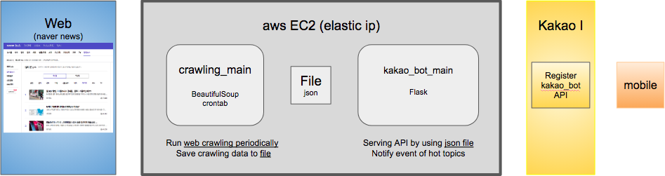
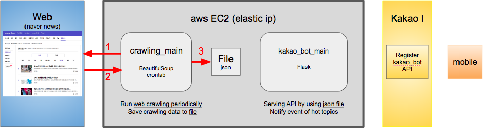
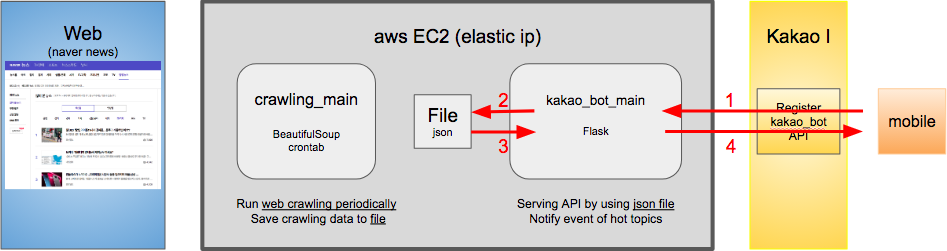
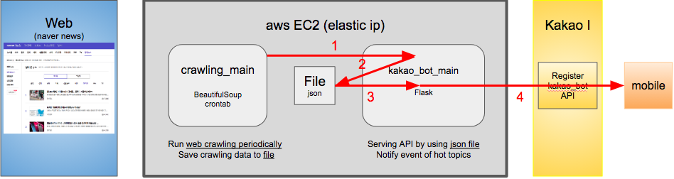

<!-- TOC -->

- [Web crawling Architecture](#web-crawling-architecture)
  - [How to do web crawling?](#how-to-do-web-crawling)
  - [Scenario1. user request](#scenario1-user-request)
  - [Scenario2. notify event](#scenario2-notify-event)
- [Developer guide](#developer-guide)
  - [Python Virtualenv 환경 구축하기](#python-virtualenv-환경-구축하기)
    - [virtualenv란!?](#virtualenv란)
  - [web-crawling repository](#web-crawling-repository)
  - [Unit test](#unit-test)
  - [Runtime run by using docker](#runtime-run-by-using-docker)

- [Web crawling Architecture](#web-crawling-architecture)
  - [How to do web crawling?](#how-to-do-web-crawling)
  - [Scenario1. user request](#scenario1-user-request)
  - [Scenario2. notify event](#scenario2-notify-event)
- [Developer guide](#developer-guide)
  - [Python Virtualenv 환경 구축하기](#python-virtualenv-환경-구축하기)
    - [virtualenv란!?](#virtualenv란)
  - [web-crawling repository](#web-crawling-repository)
  - [Unit test](#unit-test)
  - [Runtime run by using docker](#runtime-run-by-using-docker)

# Web crawling Architecture

> naver 뉴스 > 많이 본 뉴스 > IT/과학 뉴스를 crawling 하여 카카오톡 채널을 통해 user에게 제공한다.

## How to do web crawling?

> 1. crawling popular day ranking news of IT/과학 section
> 2. parse data using `beautifulsoup` and make ranking item
> 3. store it data.json file

## Scenario1. user request

> 1. request popular day ranking news from mobile
> 2. read the data.json file
> 3. process ranking item
> 4. response popular day ranking news to user

## Scenario2. notify event

> 1. notify event to kakao_bot_main periodically
> 2. read the crawling data
> 3. process ranking item and distinguish hot topics
> 4. if hot topic exists, notify event to user

  

# Developer guide

## Python Virtualenv 환경 구축하기
### virtualenv란!?
> python의 가상환경 virtualenv 모듈의 사용법을 간단하게 정리한다. python의 가상환경이란, 작은 python을 새로 설치해서 내가 원하는 모듈만 운용하는 바구니라고 생각하면 된다. 운영체제 안에서 새로 운영체제를 만들어내는 가상 머신(virtual machine)과 같은 맥락이라고 볼 수 있다. 같은 모듈이라도 이 버젼 저 버젼 다른 버젼이 필요할 때나, python 프로그램을 실행하기 위한 최소한의 환경을 마련하고자 할 때, 그리고 github 등의 저장소와 연계하고자 할 때 등 가상환경은 매우 다양하게 사용될 수 있다. 이젠 필수적인 요소가 된 python 가상 환경의 리눅스/윈도우에서의 사용법을 정리한다.

출처: https://dgkim5360.tistory.com/entry/python-virtualenv-on-linux-ubuntu-and-windows [개발새발로그]

1. python(v3.7) 버전 확인

        python3 --version

1. python3.7이 아니거나, 없다면 설치
		
        wget https://www.python.org/ftp/python/3.7.0/Python-3.7.0.tar.xz
        tar xvf Python-3.7.0.tar.xz
        cd Python-3.7.0
        ./configure
        sudo make altinstall

1. virtualenv 구축

        pip3 install virtualenv
        cd web-crawling (git directory)
        python3 -m virtualenv venv
        source venv/bin/activate

1. python modeul (requirement) 설치

        pip3 install -r requirements.txt

1. flask server 실행

        cd src
        python3 main.py

1. 동작 확인

        curl localhost:8080/route_name

## web-crawling repository

         tree
        .
        ├── crawling_main.py - - - - - - - Crawling을 수행하는 main
        ├── data.json  - - - - - - - - - - Crawling된 데이터 보관
        ├── item - - - - - - - - - - - - - Crawling 데이터 class를 위한 py module
        │   ├── __init__.py
        │   └── ranking_item.py
        ├── kakao_bot_main.py  - - - - - - Kakao bot main
        ├── test_crawling_main.py  - - - - Crawling 유닛 테스트
        └── test_kakao_bot_main.py - - - - Kakao bot 유닛 테스트

## Unit test
  - Unit test 코드를 작성해본다.
  - Unit test 코드는 local의 src/ 안에서 `pytest` 명령어를 수행하여 동작 가능하다.
    - 물론 `pytest`도 설치해야 함
    - `source venv/bin/activate`
    - `pip install -r requirements.txt`
  - 기본적인 CI를 위해 Github의 action 기능을 이용하여 commit시에 pytest를 동작 시켜 검증 가능하다.
    - [우리의 github action](https://github.com/29-75/web-crawling/actions)
    - [github action 이란?](https://medium.com/@elastic7327/%EA%B9%83%ED%97%88%EB%B8%8C%EC%9D%98-%EC%95%A1%EC%85%98-%EA%B8%B0%EB%8A%A5-git-action-%EB%A5%BC-%EC%82%AC%EC%9A%A9%ED%95%B4%EB%B3%B4%EC%9E%90-ed634d622280)

## Runtime run by using docker

        docker build -t my_app_image .
        docker run -d --name my_app_container -p 8080:8080 my_app_image
